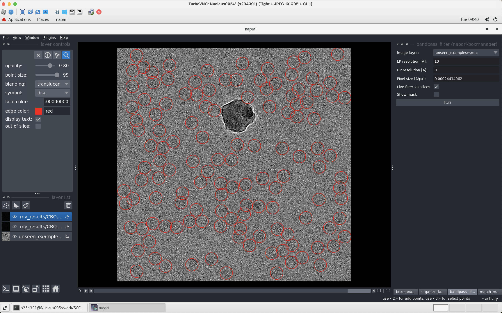

## 1. crYOLO installation

Refer to the crYOLO page:

https://cryolo.readthedocs.io/en/stable/installation.html

Please notice that during installation, installing **napari-boxmanager** forced `pip` to downgrade both **numpy** and **dask** to satisfy its own requirements, but this broke other packages in your environment.

Therefore, when you install, instead of `pip install napari-boxmanager`, let `conda` handle dependencies:

```bash
conda activate napari-cryolo
conda install -c conda-forge napari-boxmanager
###Original command is 'pip install napari-boxmanager'
```

## 2. Visualization

For prediction of reference example

https://cryolo.readthedocs.io/en/stable/other/ref_example.html

Visualize using a Desktop Environment session like **TruboVNC**. 

https://github.com/TurboVNC/turbovnc/releases

A ***desktop environment session*** is your graphical desktop workspace (GNOME, KDE, etc.). On a headless SSH session, you don’t have one — which is why GUI software like Napari can’t find GLX/OpenGL.

Once in the Desktop Environment session, load the `cryolo` module and the [Napari boxmanager](https://cryolo.readthedocs.io/en/stable/installation.html#install-napari-and-the-boxmanager-plugin) (`napari_boxmanager`) will be added to your path. To use it run a command such as:

```bash
napari_boxmanager 'unseen_examples/*.mrc' 'my_results/CBOX/*.cbox'
```



## 3. Tutorial-cryoSPARC & crYOLO for particle picking

https://cryolo.readthedocs.io/en/stable/other/cryolo_submit_job.html#queueing-label